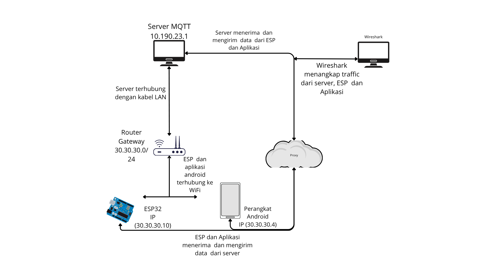

# ⚡ Sistem Monitoring Penggunaan Daya Listrik Secara Real-Time Berbasis Internet of Things (IoT) dengan Protokol MQTT QoS Level 1

**Penulis :** Indro Dwi Saputro
**NIM :** 2009106099
**Program Studi :** Informatika, Fakultas Teknik
**Universitas Mulawarman – 2025**

---

## 🧠 Deskripsi Singkat

Proyek ini merupakan hasil penelitian skripsi yang bertujuan untuk **merancang dan membangun sistem monitoring penggunaan daya listrik secara real-time berbasis IoT** menggunakan **protokol MQTT QoS Level 1**.
Sistem terdiri dari **ESP32** sebagai mikrokontroler, **sensor PZEM-004T** untuk membaca data listrik, **Mosquitto broker** sebagai server komunikasi MQTT, dan **aplikasi Android (Kodular)** untuk menampilkan hasil monitoring secara real-time.

---

## ⚙️ Arsitektur Sistem

```
[PZEM-004T] ⇄ [ESP32] ⇄ [Router Wi-Fi]
         ↓
     [Broker MQTT (Mosquitto)]
         ↓
     [FRP Server Publik]
         ↓
  [Aplikasi Android (Kodular)]
```


---

## 🔌 Skematik Koneksi ESP32 dan PZEM-004T

| PZEM-004T | ESP32        |
| --------- | ------------ |
| VCC       | 5V           |
| GND       | GND          |
| TX        | RX2 (GPIO16) |
| RX        | TX2 (GPIO17) |

> Gunakan catu daya 5V stabil untuk modul PZEM-004T dan pastikan ground disatukan dengan ESP32.


---

## 🧩 Komponen

| Komponen        | Deskripsi                       |
| --------------- | ------------------------------- |
| Mikrokontroler  | ESP32                           |
| Sensor          | PZEM-004T                       |
| Komunikasi      | MQTT QoS Level 1                |
| Broker          | Mosquitto                       |
| Proxy           | Fast Reverse Proxy (FRP)        |
| Aplikasi Mobile | Kodular                         |
| Analisis        | Wireshark (Delay & Packet Loss) |

---

## 🚀 Cara Instalasi

### 1. Clone Repository

```bash
git clone https://github.com/IndroMan/sistem-monitoring-daya-listrik.git
cd sistem-monitoring-daya-listrik
```

### 2. Upload Kode ke ESP32

Buka file `.ino` di **Arduino IDE** lalu sesuaikan:

```cpp
const char* ssid = "NamaWiFi";
const char* password = "PasswordWiFi";
const char* mqtt_server = "ip_broker";
const int mqtt_port = 1883;
const char* topic = "sesuaikan topiknya";
HardwareSerial pzemSerial(2);
PZEM004Tv30 pzem(pzemSerial, 16, 17); // RX, TX
```

Upload ke board ESP32.

---

## 📡 Jalankan Broker MQTT

### a. Jalankan Mosquitto

```bash
mosquitto -v
```

### b. Jalankan FRP

Edit file `frpc.ini`:

```ini
[common]
server_addr = <alamat_server_public>
server_port = 7000

[mqtt]
type = tcp
local_ip = 127.0.0.1
local_port = 1883
remote_port = 1883
```

Lalu jalankan:

```bash
frpc -c frpc.ini
```

---

## 📱 Tampilan Aplikasi Android (Kodular)

Aplikasi menampilkan data:

* Tegangan (Volt)
* Arus (Ampere)
* Daya (Watt)
* Energi (kWh)
* Estimasi biaya listrik


---

## 📂 Struktur Folder

```
/sistem-monitoring-daya-listrik
│
├─ /kodingan arduino      # Source code ESP32
├─ /konfig broker         # Konfigurasi Mosquitto
├─ /konfig frp            # File frpc.ini / frps.ini
├─ /apk android           # File .aia / .apk Kodular
├─ /Gambar                # Topologi, skematik, output aplikasi
└─ README.md
```

---

## 🧾 Kesimpulan

* Sistem IoT berhasil memantau daya listrik secara **real-time dan akurat**.
* **QoS Level 1** menjamin pengiriman data minimal satu kali (reliable).
* Hasil uji **delay** dan **packet loss** berada dalam kategori **sangat baik** berdasarkan standar **ITU-T Y.1541**.

---

## ✉️ Kontak

**Indro Dwi Saputro**
📧 [indrodwi2@gmail.com](mailto:indrodwi2@gmail.com)
🌐 [github.com/IndroMan](https://github.com/IndroMan)
📍 Samarinda, Kalimantan Timur

---
